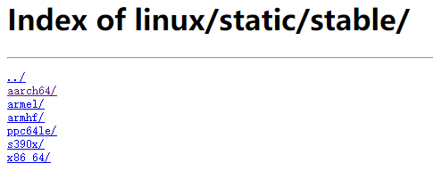
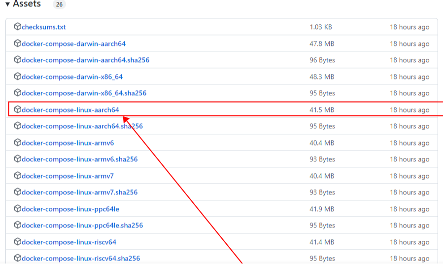

## 1.准备 docker.service系统配置文件
（复制以下内容保存为 docker.service 文件，一定是要全部，包括最上面的 docker.service ！！！）

```
docker.service
  
[Unit]
Description=Docker Application Container Engine
Documentation=https://docs.docker.com
After=network-online.target firewalld.service
Wants=network-online.target

[Service]
Type=notify
# the default is not to use systemd for cgroups because the delegate issues still
# exists and systemd currently does not support the cgroup feature set required
# for containers run by docker
ExecStart=/usr/bin/dockerd
ExecReload=/bin/kill -s HUP $MAINPID
# Having non-zero Limit*s causes performance problems due to accounting overhead
# in the kernel. We recommend using cgroups to do container-local accounting.
LimitNOFILE=infinity
LimitNPROC=infinity
LimitCORE=infinity
# Uncomment TasksMax if your systemd version supports it.
# Only systemd 226 and above support this version.
#TasksMax=infinity
TimeoutStartSec=0
# set delegate yes so that systemd does not reset the cgroups of docker containers
Delegate=yes
# kill only the docker process, not all processes in the cgroup
KillMode=process
# restart the docker process if it exits prematurely
Restart=on-failure
StartLimitBurst=3
StartLimitInterval=60s

[Install]
WantedBy=multi-user.target


```

## 2. 下载离线包

### 2.1 下载 docker 离线包

下载地址：https://download.docker.com/linux/static/stable/

选择系统架构对应的文件目录，如 `aarch64`。本教程使用版本：`docker-20.10.7.tgz`


### 2.2 下载 docker-compose 离线包

Github 下载地址：https://github.com/docker/compose/releases

选择对应系统架构的离线安装包。本教程使用版本：`v2.17.2`

---

## 3. 安装 docker 和 docker-compose 离线包

docker-28.3.3-aarch64.tgz 和 docker-compose-linux-aarch64、docker.service 三个安装文件，都放在 /data/chatdata-deploy 目录下，有需要可自行更改，不做强制要求

- 以下命令必须要一步一步来，有必要的话，直接复制我的命令，以免打错

```
# 进入安装文件存放目录
$ cd /data/chatdata-deploy

# 解压 docker 到当前目录
$ tar -xvf docker-20.10.7.tgz

# 将 docker 文件移动到 /usr/bin 目录下
$ cp -p docker/* /usr/bin

# 将 docker-compose 文件复制到 /usr/local/bin/ 目录下，并重命名为 docker-compose
$ cp docker-compose-linux-aarch64 /usr/local/bin/docker-compose

# 设置 docker-compose 文件权限
$ chmod +x /usr/local/bin/docker-compose

# 将 docker.service 移到 /etc/systemd/system/ 目录
$ cp docker.service /etc/systemd/system/

# 设置 docker.service 文件权限
$ chmod +x /etc/systemd/system/docker.service

# 重新加载配置文件
$ systemctl daemon-reload

# 启动docker
$ systemctl start docker

# 设置 docker 开机自启
$ systemctl enable docker.service


```

## 4. 验证 docker 安装是否成功
```
# 查看docker版本
$ docker version

# 查看docker-compose版本
$ docker-compose --version
```

Tips：安装完之后，如果查看版本找不到，记得把窗口重新打开，以免自己以为没安装成功，重要的事情说三遍！！！
Tips：安装完之后，如果查看版本找不到，记得把窗口重新打开，以免自己以为没安装成功，重要的事情说三遍！！！
Tips：安装完之后，如果查看版本找不到，记得把窗口重新打开，以免自己以为没安装成功，重要的事情说三遍！！！